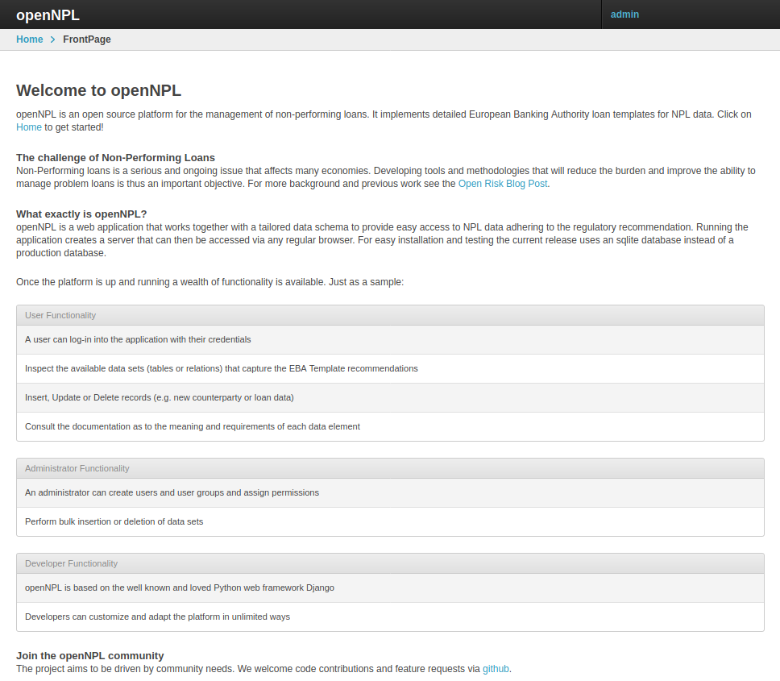
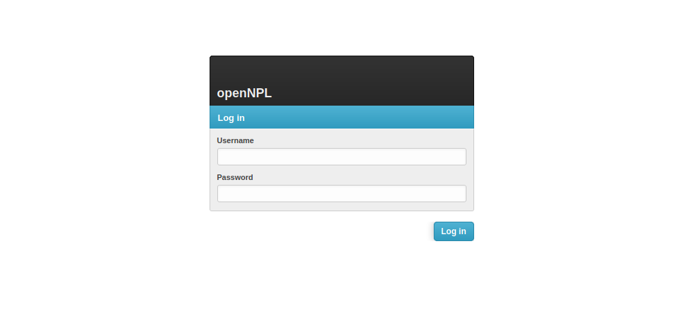
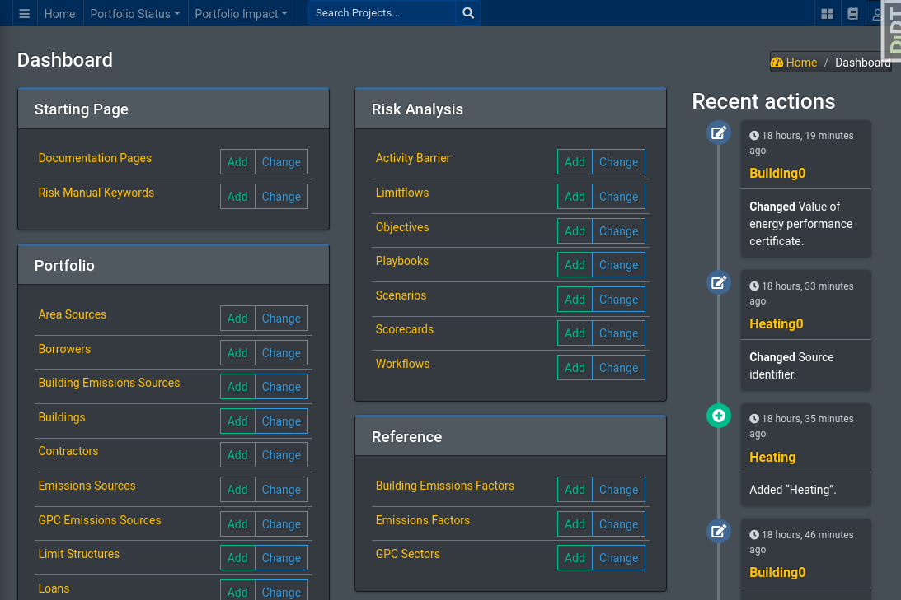

# Equinox Overview
 Equinox is an open source platform for sustainable portfolio management. It supports the holistic risk management and reporting of sustainable finance projects in accordance with industry standards.

## The Challenge of Sustainable Finance
Sustainability (understood both in environmental and social terms) is a serious and ongoing issue that affects all economies. Developing tools and methodologies that improve the ability of all stakeholders to assess and report risks is thus an important objective

## What exactly is Equinox?
Equinox is a *database and a web application frontend* that works together with a tailored data schema to provide a flexible and powerful Sustainable Finance platform adhering to many regulatory and ESG initiatives and recommendations. 

Running the application creates a local *server* that can then be accessed via any regular web browser. For easy installation and testing the current release uses an sqlite database instead of a production database.

## Functionality

The initial functionality of Equinox focuses on integrating the following concepts:

* The European Banking Authority's Criteria for Credit Risk Assessment of Project Finance under the Standardized approach for Specialized Lending 
* The PCAF coalition's approach to accounting and reporting project finance GHG emissions
* Equator Principles for Project Finance
* GHG Accounting Protocol for Projects

## Screenshots

The landing page of a working equinox instance:

To get anything done we need to login! (admin/admin would be the credentials in a local demo instance)

Once you login successfully you'd be greeted by the admin area

The admin is our main workbench

## Credits
* The Python and Django ecosystems and the many powerful software components (Geodjango, Jazzmin, ... full list coming) 
* The GHG Protocol
* The European Banking Authority
* The Partnership for Carbon Accounting Financials  
* The Equator Principles Alliance