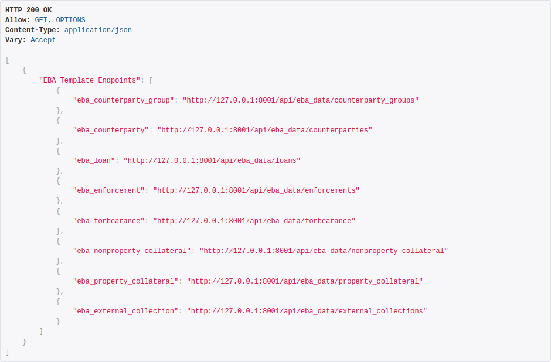
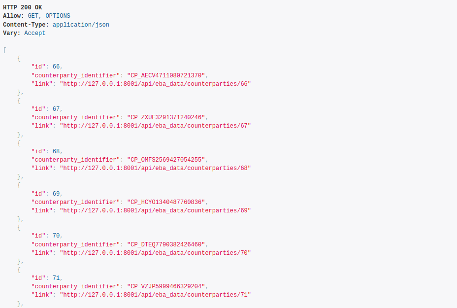

REST API
================

.. image:: ./screenshots/API.png

equinox exposes a standard REST API via the Django DRF framework.

API Root
-----------------------
The root of the equinox API is accessed by by pointing your browser to ``http://localhost:8001/api``

We see here the available API endpoints, which enumerate the different portfolio data categories that are being exposed

Lets click at that "eba_counterparty" collection: ``http://127.0.0.1:8001/api/TODO/counterparties``

Collections
-----------

We are now one level deeper into the API structure, where we can see all the distinct entries available within the "counterparties" collection.

Each entry displays its unique identifier and a further link which will take us to the data of an individual entry

Individual Entries
------------------

.. image:: ./screenshots/api3.png

.. TODO:: Missing are the following: the Lease Table and the Schedule tables (Swap cashflows and Historical Repayments)

.. warning:: At present only GET and POST actions are implemented

API Docs
---------

Two different API doc generators are included on an experimental basis:

* Swagger Style: ``http://localhost:8001/api/swagger``
* Redoc Style: ``http://localhost:8001/api/redoc``

