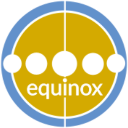

.. equinox documentation master file

equinox Documentation
==============================

**Equinox** is an open source platform for sustainable portfolio management. Equinox implements and integrates a number of regulatory and industry standards that address GHG emissions attribution and reporting and enables the associated ESG risk analysis.

These pages serve as online **technical documentation** of the equinox platform explaining its code structure and administration. For **user oriented documentation** and supported portfolio management workflows please consult the `Equinox User Manuals <https://www.openriskmanagement.com/equinox/>`_

.. note:: The equinox project and its documentation is still in the development phase and is not yet suitable for production deployments. Feel free to contact us for the development roadmap and any other requests / feedback.

Overview and Quick Links
--------------------------

* Author: `Open Risk <http://www.openriskmanagement.com>`_
* License: MIT
* Development Website: `Github <https://github.com/open-risk/equinox>`_
* Docker Image: `Docker Hub <https://hub.docker.com/repository/docker/openrisk/equinox>`_
* Online `Code Documentation <https://equinox-server.readthedocs.io/en/latest/>`_
* Online `User Manuals <https://www.openriskmanagement.com/equinox/>`_
* Discussion `Forum <https://www.openriskcommons.org/c/equinox/27>`_
* User Training @ `Open Risk Academy <https://www.openriskacademy.com/>`_

Table of Contents
----------------------

.. toctree::
   :maxdepth: 2
   :caption: Getting Started:

   description
   setup
   testing
   requirements
   initialization

.. toctree::
   :maxdepth: 2
   :caption: Technical Documentation:

   modules
   applications
   api
   api_docs
   internationalization
   changelog
   portfolio-changelog
   policy-changelog
   reference-changelog
   reporting-changelog
   risk-changelog
   start-changelog

.. toctree::
   :maxdepth: 2
   :caption: Community:

   conventions
   contributing
   code_of_conduct

Indexes and Tables
==================

* :ref:`genindex`
* :ref:`search`
